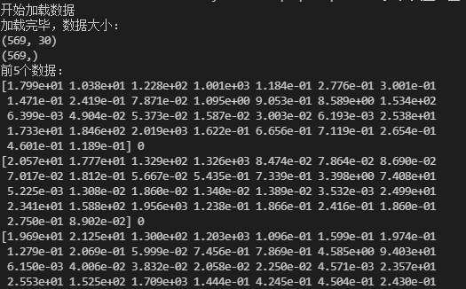
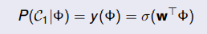
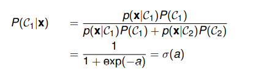
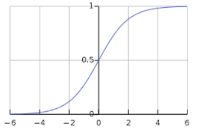
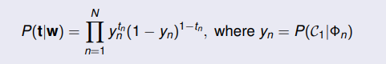
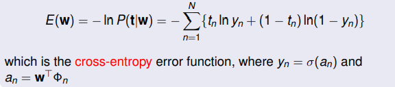
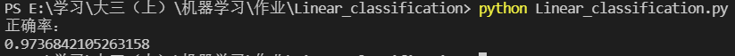

# Linear classification实验报告

### 陈家豪 19307130210


## 一、数据处理

本次实验数据集为 Breast cancer dataset

通过sklearn.datasets获取数据

```python
cancer = load_breast_cancer()
cancer_x=cancer.data
cancer_y=cancer.target
```

查看数据大小即部分数据：

```
print("加载完毕，数据大小：")
print(cancer_x.shape)
print(cancer_y.shape)
print("前5个数据：")
for i in range(5):
print(cancer_x[i],cancer_y[i])
```



breast cancer 的影响因素有30个，结果为0,1，表示是否患病


对数据进行拆分, test_size=0.2：

` x_train,x_test,y_train, y_test=train_test_split(cancer_x,cancer_y,test_size=0.3)`


## 二、算法

用到 logistic regression 算法

logistic sigmoid function





函数图形，结果若大于0.5，归类为1，若小于0.5，归类为0



the likelihood function



the error function



用梯度下降算法求出误差最小的w


## 三、模型

```python
if __name__ == '__main__':
    
    #开始加载数据
    cancer =load_breast_cancer()
    cancer_x=cancer.data
    cancer_y=cancer.target
    #分割数据，训练集测试集
    x_train,x_test,y_train, y_test=train_test_split(cancer_x,cancer_y,test_size=0.2)
    #选择模型
    model = linear_model.LogisticRegression(max_iter=10000)
    #训练模型
    model.fit(x_train,y_train)
    #预测测试集数据的结果
    y_pred = model.predict(x_test)
	#计算判断正确率
    i = 0
    count=0
    for y in y_test:
        if(y==y_pred[i]):
            count+=1
        i+=1
    score = count/i
    
    print(score)
```

1. 加载数据，并按比例分割成训练集，测试集
2. 选择模型`LogisticRegression`
3. 用训练集数据训练模型
4. 用模型计算测试集数据的结果
5. 计算预测结果与真实结果的正确率


## 四、结果



模型判断准确率为0.974左右，准确率很高，说明LogisticRegression模型效果很好


