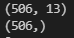
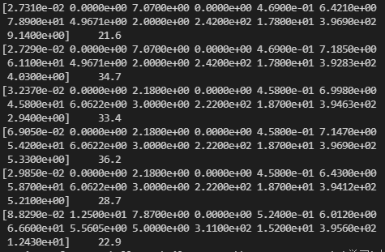
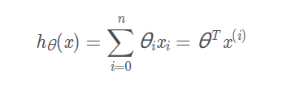
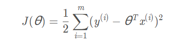
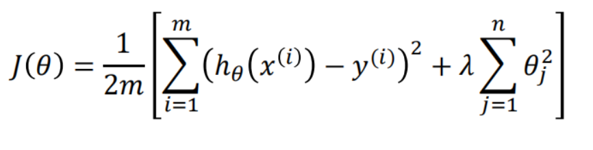
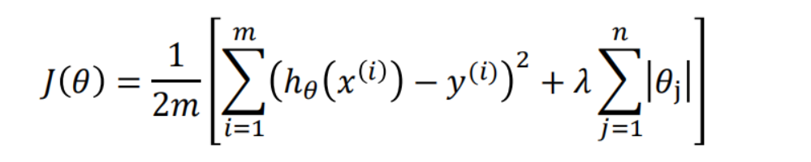
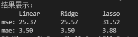

# Linear Regression 实验报告

### 陈家豪19307130210

### 2021.10.19


## 一、数据处理


本次数据集为 Boston House Price 数据集，房价影响因素及房价

通过sklearn.datasets获取数据

```python
boston = load_boston()
x,y = boston.data,boston.target
```


查看数据大小：

```
print(x.shape)
print(y.shape)
```



数据共506项，数据集有13种影响因素

查看部分数据：

```python
for i in range(7):
    print(x[i],'   ',y[i])
```




对数据进行拆分，测试集比例test_size=0.2

`x_train, x_test, y_train, y_test = train_test_split(x,y,test_size=0.2)`


## 二、算法

共采用三种regression算法

### Linear Regression

目标函数：



Loss Function: 最小二乘法



采取梯度下降算法，求出使误差最小的参数，则得到最终模型


### Ridge Regression

加入L2正则项来调优模型。下面是Ridge Regression的损失函数;




### Lasso Regression

加入L1正则项来调优模型。下面是Lasso Regression的损失函数;




## 三、模型：

#### LinearRegressionPred函数

参数：训练集数据、训练集标签、测试集数据、测试集标签

选择LinearRegression训练模型拟合训练集，再用拟合得到的模型去预测x_test对应的价格

最后计算预测值与实际值的差距，分别计算MSE,MAE，并返回

```
def LinearRegressionPred(x_train,x_test,y_train,y_test):

    model = linear_model.LinearRegression()      #选择模型
    model.fit(x_train,y_train)      #拟合
    y_pred = model.predict(x_test)  #预测
    
    loss1 = mean_squared_error(y_test, y_pred)       #计算损失函数
    loss2 = mean_absolute_error(y_test, y_pred)
    
    return loss1,loss2
```

#### RidgeRegressionPred,  LassoRegressionPred函数

与LinearRegressionPred的唯一区别在于选取的模型不同

```
def RidgeRegressionPred(x_train,x_test,y_train,y_test):
    model = linear_model.Ridge()    #选择模型
    model.fit(x_train,y_train)      #拟合
    y_pred = model.predict(x_test)  #预测
    
    loss1 = mean_squared_error(y_test, y_pred)       #计算损失函数
    loss2 = mean_absolute_error(y_test, y_pred)
    
    return loss1,loss2

def LassoRegressionPred(x_train,x_test,y_train,y_test):
    model = linear_model.Lasso()    #选择模型
    model.fit(x_train,y_train)      #拟合
    y_pred = model.predict(x_test)  #预测
    
    loss1 = mean_squared_error(y_test, y_pred)       #计算损失函数
    loss2 = mean_absolute_error(y_test, y_pred)
    
    return loss1,loss2
```


#### 主程序：

为了防止划分不同带来的结果误差，设置测试次数testNum=10，共进行10次实验

每次实验对数据集进行划分，并依次调用上面三个函数，得到测试结果

最后得出10次实验误差的平均值

```python
for i in range(testNum):
    x_train, x_test, y_train, y_test = train_test_split(x,y,test_size=0.2)
    t1,t2 = LinearRegressionPred(x_train, x_test, y_train, y_test)
    mseLinear+=t1
    maeLinear+=t2

    t1,t2 = RidgeRegressionPred(x_train, x_test, y_train, y_test)
    mseRidge+=t1
    maeRidge+=t2

    t1,t2 = LassoRegressionPred(x_train, x_test, y_train, y_test)
    mseLasso+=t1
    maeLasso+=t2
    
print("结果展示：")
print("     Linear      Ridge       lasso")
print("mse: %.2f       %.2f       %.2f "%   (mseLinear/testNum,mseRidge/testNum,mseLasso/testNum))
print("mae: %.2f        %.2f        %.2f "% (maeLinear/testNum,maeRidge/testNum,maeLasso/testNum))

```


## 四、实验结果



三种算法中，Linear Regression, Ridge Regression得到预测结果最好，MSE为25.37、25.57，MAE为3.50、3.50

Lasso Regression的预测结果最差，MSE为31.52, MAE为3.88