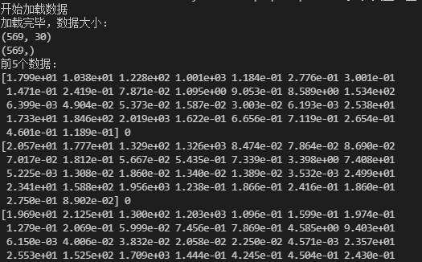
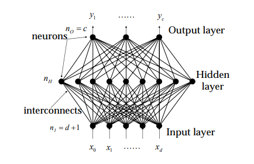
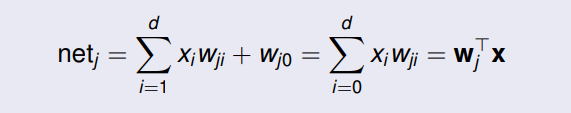
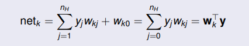
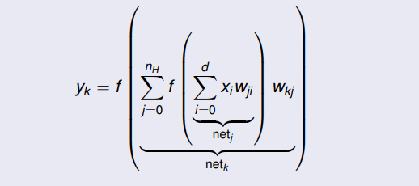
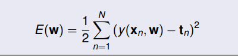
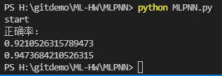

# MLPNN实验报告

### 陈家豪 19307130210

## 一、数据处理

本次实验数据集为 Breast cancer dataset

通过sklearn.datasets获取数据

```python
cancer = load_breast_cancer()
cancer_x=cancer.data
cancer_y=cancer.target
```

查看数据大小即部分数据：

```
print("加载完毕，数据大小：")
print(cancer_x.shape)
print(cancer_y.shape)
print("前5个数据：")
for i in range(5):
print(cancer_x[i],cancer_y[i])
```



breast cancer 的影响因素有30个，结果为0,1，表示是否患病

对数据进行拆分, test_size=0.2：

` x_train,x_test,y_train, y_test=train_test_split(cancer_x,cancer_y,test_size=0.2)`


## 二、算法



如图为单层隐藏层的MLPNN模型示意图，输入层为数据集的数据，输出层为数据集的标签

隐藏层神经元表示为：



每个单元发出它的激活函数：


输出层为：



每个单元输出其激活函数：


映射函数：




误差函数：

平方和误差函数：




## 三、模型

```
#'sgd' 指的是随机梯度下降；
clf = MLPClassifier(solver='sgd')
clf.fit(x_train,y_train)
y_pred = clf.predict(x_test)
print(accuracy(y_test,y_pred))

#'lbfgs' 是准牛顿方法族的优化器；
clf2 = MLPClassifier(solver='lbfgs')
clf2.fit(x_train,y_train)
y_pred2 = clf2.predict(x_test)
print(accuracy(y_test,y_pred2))
```

模型 MLPClassifier, 其中参数solver表示权重优化的求解器。'lbfgs’是准牛顿方法族的优化器；'sgd’指的是随机梯度下降。

参数alpha是L2惩罚参数，默认值0.0001

参数max_iter是最大迭代次数，默认值200

参数hidden_layer_sizes是隐藏层神经元数，默认值（100，）


## 四、结果



用‘sgd’的正确率为：0.921

用‘lbfgs’的正确率为：0.947

