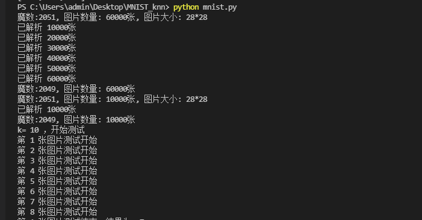
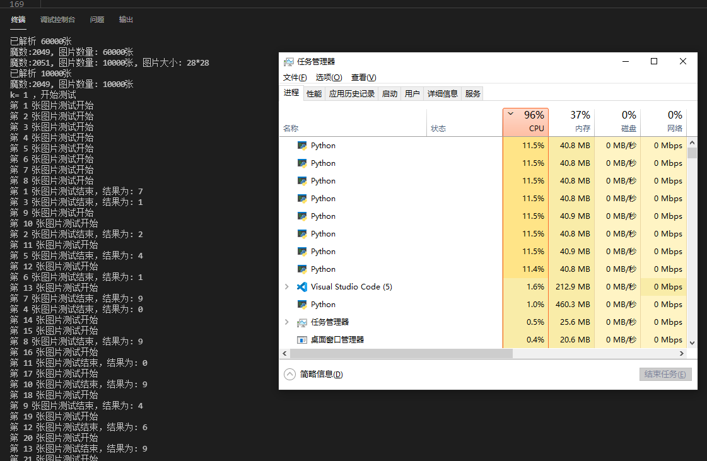
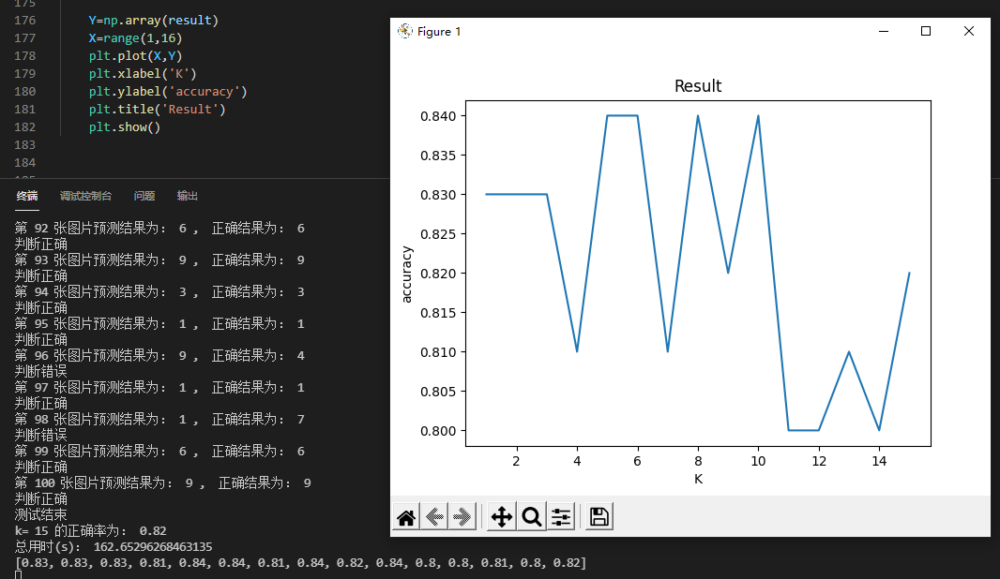
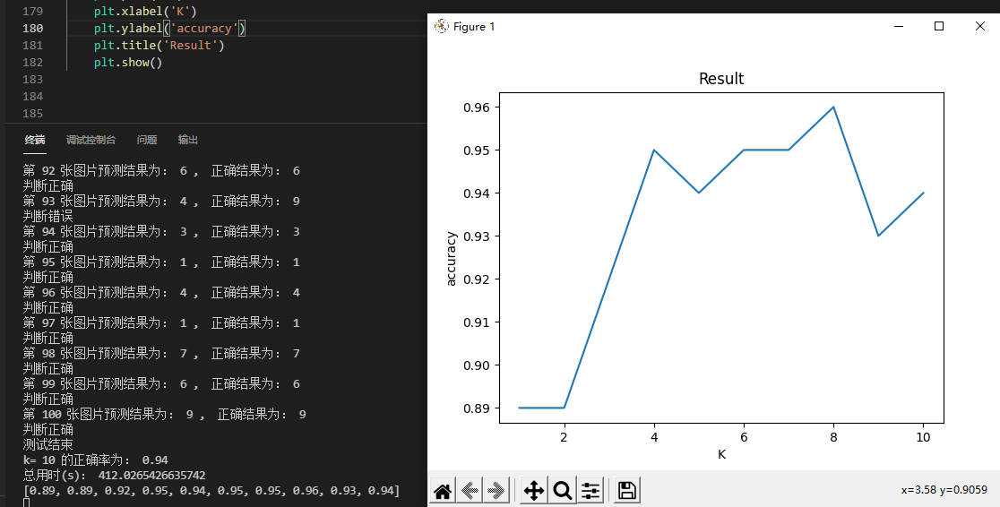
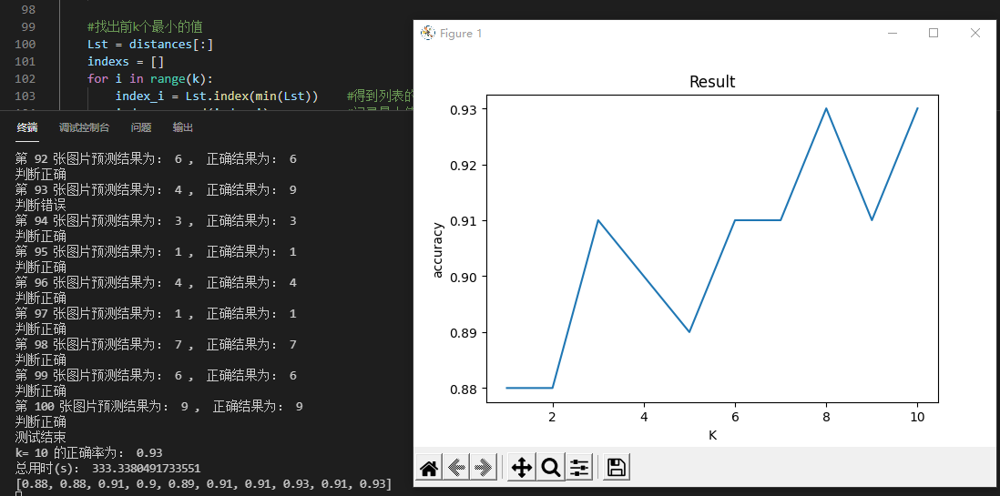

# MNIST实验报告

实验环境：

CPU：i5 10400F

系统：windows10

python 3.8.0

## 一、数据处理

编写decodeImages(),decodeLables()函数分别解析图片文件和标签文件

打开二进制文件，用到struct.unpack_from()函数获取数据

```python
# 解析文件头信息，依次为魔数、图片数量、每张图片高、每张图片宽
    offset = 0
    fmt = '>iiii' #unpack_from()函数中读取格式，表示读取4个32bit int型
    magicNumber, numImages, numRows, numCols = struct.unpack_from(fmt, data, offset)
    print('魔数:%d, 图片数量: %d张, 图片大小: %d*%d' % (magicNumber, numImages, numRows, numCols))

# 解析图片数据集
    imageSize = numRows * numCols
    offset += 16  #指针位置移动。
    fmt = '>' + str(imageSize) + 'B'  #读取28*28个unsigned char类型的数据，即一个图片的所有像素
    images = np.empty((numImages, numRows, numCols)) #创建数组，存放图片像素信息
    #plt.figure()
    for i in range(numImages):
        if (i + 1) % 10000 == 0:
            print('已解析 %d' % (i + 1) + '张')
        #解析第i张图片，放入数组images中
        imageData = struct.unpack_from(fmt,data,offset)
        imageData=np.array(imageData)
        images[i]=imageData.reshape((numRows,numCols))
        offset += struct.calcsize(fmt) #指针移动
```


## 二、模型描述

1.解析文件，获取训练集、测试集图片标签数据

```python
	#获取训练集、测试集数据
    trainImages = decodeImages('train-images.idx3-ubyte')
    trainLables = decodeLables('train-labels.idx1-ubyte')
    testImages = decodeImages('t10k-images.idx3-ubyte')
    testLables = decodeLables('t10k-labels.idx1-ubyte')
```


2.for循环设置不同k值，将参数传入测试函数test()，获取不同k值下测试的正确率

​	测试时为了节省时间设置了训练集、测试集用到的数据量TRAIN_NUM=1000,TEST_NUM=100	

```python
for k in range(1,13):
    print('k=',k,'，开始测试')
    temp = test(trainImages[:TRAIN_NUM],trainLables[:TRAIN_NUM],testImages[:TEST_NUM],testLables[:TEST_NUM],k)
    print('测试结束')
    print('k=',k,'的正确率为：',temp)
    result.append(temp)
```


3.test()函数，测试函数，参数=(训练集图片，训练集标签，测试集图片，测试集标签，k值)

​	作用是在指定k值下用knn算法判断测试集中每个图片的数字，并与测试集标签中的数据比对，计算判断的正确率并返回

​	为提高效率，运用多进程模块，创建进程数为8的进程池，最多同时进行8个图片的计算

```python
for i in range(num):	#num为测试图片数量
    arg = (trainImages,trainLables,testImages[i],k,i)   #创建进程
    p = pool.apply_async(knn, args=arg)
    result.append(p)
```

```python
for i in range(num):
    p=result[i]
    res = p.get()       #返回结果
    print('第',i+1,'张图片预测结果为：',res,',  正确结果为：',int(testLables[i]))
    if testLables[i]==res:
        print('判断正确')
        count+=1
    else :
        print('判断错误')

return count/num
```


4.knn()函数，用knn算法计算待测图片数字，参数=（训练集图片，训练集标签，测试图片，k，测试图片序号）

过程：

​	依次计算测试图片与训练集中每个点的距离，此处采用欧式距离distance1(x,y)，并将距离存入列表distances；

```python
    #计算x与trainImages中每个点的距离，放入数组
    for i in trainImages:
        temp = distance1(i,x)
        distances.append(temp)
```

​	找出列表前k个最小值的索引，算法为遍历k次列表找最小值并记录索引；

```python
    #找出前k个最小的值
    Lst = distances[:]                        
    indexs = []
    for i in range(k):
        index_i = Lst.index(min(Lst))    #得到列表的最小值，并得到该最小值的索引
        indexs.append(index_i)           #记录最小值索引
        Lst[index_i] = float('inf')      #将遍历过的列表最小值改为无穷大，下次不再选择
```

​	通过索引，找出训练集标签中对应的标签存入列表lables，为每个标签计数，找出数量最多的标签返回结果

```python
    #取前k个标签
    lables = []
    for i in range(k):
        lables.append(trainLables[indexs[i]])
    #为每个标签计数
    count = np.zeros(10)
    for i in lables:
        count[int(i)]+=1
```


## 三、实验效果

实验过程中采用TRAIN_NUM=1000, TEST_NUM=100,取部分数据进行测试，测试k的范围为1-15

#### 1.解析文件过程如图：



#### 2.多进程效果展示，CPU利用率接近100%，速度明显提升

理论上会比单进程逐个计算的时间缩短8倍




#### 3.结果展示

粗测： 

取训练集前1000项数据，测试集前100项数据，k取值1-15，测试完总用时为162s，用matplotlib库绘制折线图如图

此时正确率最高的点出现在k=5,6,8,10这4处，正确率为0.84




第二次实验：

将实验数据调至取训练集前4000项，测试集前100项，k取值1-10，结果如下：

总用时412s，正确率最大点k=8，正确率为0.96




#### 4.结论

由于电脑性能有限，不便测量完整的数据，于是暂且得出结论：在k=8时，knn算法判断准确率最高


## 四、模型优化

#### 1.可以改变点与点之间的距离公式

两点间的距离公式可采用曼哈顿距离、欧式距离、切比雪夫距离等

程序中仅需编写一个新的距离计算函数distance2，并替换knn函数中distance1的位置就可以改变距离计算公式

```python
def knn(trainImages,trainLables,x,k,procnum):
    
    print('第',procnum+1,'张图片测试开始')
    distances = []
    #计算x与trainImages中每个点的距离，放入数组
    for i in trainImages:
        temp = distance1(i,x)
        distances.append(temp)

```

换成曼哈顿距离公式之后的测试结果如图，k=8时正确率最高，为0.93，总用时333s

相比欧氏距离正确率下降了




#### 2.多进程提高效率

在test()函数中运用了multiprocessing模块，最高开8个进程同时计算，提高了效率。

可根据CPU性能增加或减少进程数，充分利用CPU


#### 3.排序算法优化

在计算完待测点与训练集的距离之后，需要选出前k个距离最小的点。

此处最快的算法为依次将结果放入队列，再从头到尾遍历k次，找出最小的。复杂度为n*k

若要维持一个最小堆，在插入时需要逻辑判断，会增加耗时；若要内部排序则更增加耗时。


## 五、总结

本次实验实现了knn算法，对MNIST手写数字数据集进行了分类

实验采用了多进程方法进行优化，并选择了适当的方法选取数列中前k小个数，缩短了程序运行时间

在取前4000个训练集数据，前100个测试集数据的情况下，采取距离公式为欧氏距离，对k取1-15的值进行测试获得正确率

结论为，在k=8时，正确率达到最高值0.96

且在采用曼哈顿距离公式的情况下，在k=8时正确率达到最高为0.93

