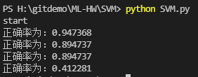

# SVM实验报告

### 陈家豪 19307130210

## 一、数据处理

本次实验数据集为 Breast cancer dataset

通过sklearn.datasets获取数据

```python
cancer = load_breast_cancer()
cancer_x=cancer.data
cancer_y=cancer.target
```

查看数据大小即部分数据：

```
print("加载完毕，数据大小：")
print(cancer_x.shape)
print(cancer_y.shape)
print("前5个数据：")
for i in range(5):
print(cancer_x[i],cancer_y[i])
```


breast cancer 的影响因素有30个，结果为0,1，表示是否患病

对数据进行拆分, test_size=0.2：

` x_train,x_test,y_train, y_test=train_test_split(cancer_x,cancer_y,test_size=0.2)`

## 二、算法

#### SVM算法原理

SVM学习的基本想法是求解能够正确划分训练数据集并且几何间隔最大的分离超平面。如下图所示即为分离超平m面。


**几何间隔**：对于给定的数据集 和超平面 ，定义超平面关于样本点的几何间隔为


超平面关于所有样本点的几何间隔的最小值为

根据以上定义，SVM模型的求解最大分割超平面问题可以表示为以下约束最优化问题


经变化，SVM模型的求解最大分割超平面问题又可以表示为以下约束最优化问题


对其使用拉格朗日乘子法得到其对偶问题（dual problem）。将有约束的原始目标函数转换为无约束的新构造的拉格朗日目标函数


经变化得：


计算：


求分离超平面：

### kernel

用核函数替换目标函数和分类决策函数中的内积。核函数表示，通过一个非线性转换后的两个实例间的内积。


求分离超平面


分类决策函数


#### 核函数有三种：

1.高斯核函数（rbf）


2.多项式核函数


3.sigmoid核函数


线性核函数就是


## 三、模型

获取数据后选取各类模型，用训练集数据训练，然后用模型预测测试集结果，与真实结果比较，计算各模型的正确率。

#### 第一个模型：linear kernel

```
svc_clf = SVC(kernel='linear')
svc_clf.fit(x_train,y_train)
y_pred = svc_clf.predict(x_test)
print("正确率为：%f"% accuracy(y_test,y_pred))
```

#### 第二个模型：poly kernel

```
svc_clf2 = SVC(kernel='poly', degree=4)
svc_clf2.fit(x_train,y_train)
y_pred2 = svc_clf2.predict(x_test)
print("正确率为：%f"%accuracy(y_test,y_pred2))
```

#### 第三个模型：rbf kernel

```
svc_clf3 = SVC(kernel='rbf')
svc_clf3.fit(x_train,y_train)
y_pred3 = svc_clf3.predict(x_test)
print("正确率为：%f"%accuracy(y_test,y_pred3))
```

#### 第四个模型：sigmoid kernel

```
svc_clf4 = SVC(kernel='sigmoid')
svc_clf4.fit(x_train,y_train)
y_pred4 = svc_clf4.predict(x_test)
print("正确率为：%f"%accuracy(y_test,y_pred4))
```

## 四、结果



在4个模型中

线性的正确率最大,为0.947

sigmoid的正确率最小，为0.412

poly,rbf kernel 的正确率相同，为0.895

本次实验中linear kernel效果最好
