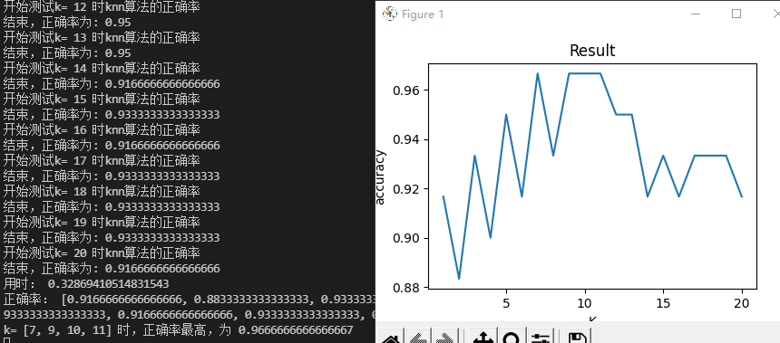
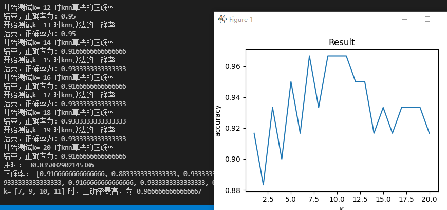
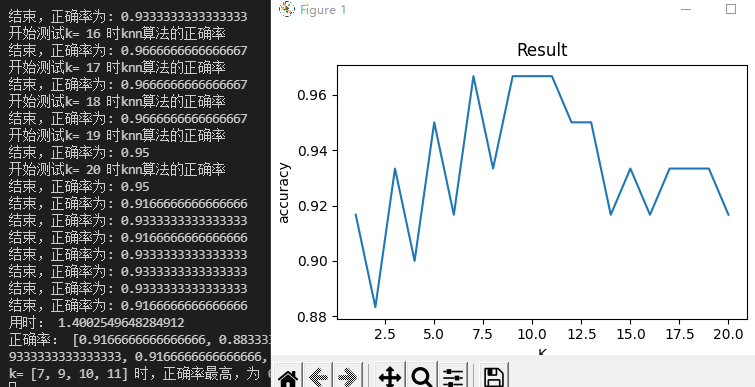
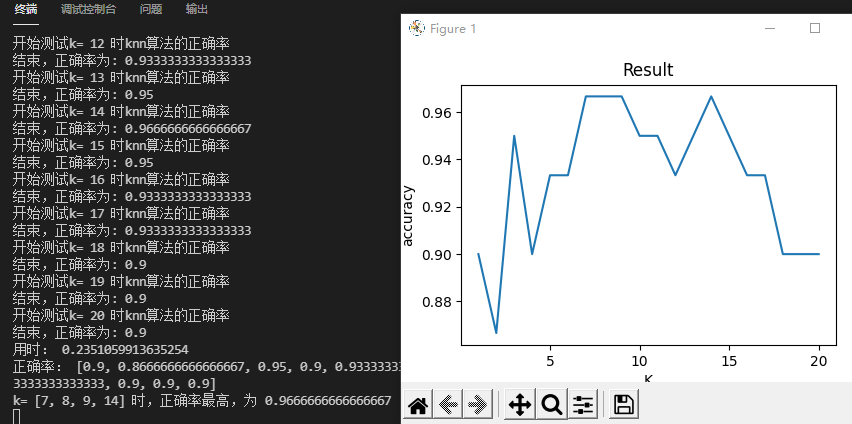

# KNN分类-实验报告

实验环境：

CPU：i5 10400F

系统：windows10

python 3.8.0

### 一、数据处理

从datasets.load_iris()中获取数据集

设置测试集占总的比例testsize=0.4，用train_test_split函数进行划分

```python
	#加载数据
	print('开始加载数据')
    iris = datasets.load_iris()
    X=iris.data
    Y=iris.target
    print('加载完毕')
    #划分
    X_train,X_test,Y_train,Y_test=train_test_split(X, Y, test_size=testsize, random_state=0)
    print('划分完毕')
```


### 二、模型描述

def main_1()  	#主函数

1.解析文件，获取训练集、测试集数据

2.for循环设置不同k值，将参数传入测试函数test()，获取不同k值下测试的正确率

```python
	print('开始测试')
    #取k值为1~20进行实验，测试正确率
    result=[]
    for k in range(1,max_k+1):
        res=test_mtprocess(X_train,Y_train,X_test,Y_test,k)   #多进程版本
        #res=test(X_train,Y_train,X_test,Y_test,k)              #普通版本
        result.append(res)
```

3.test()函数，测试函数，参数=(训练集数据，训练集标签，测试集数据，测试集标签，k值)

​	作用是在指定k值下用knn算法判断测试集中每个数据的标签，并与测试集标签中的数据比对，计算判断的正确率并返回

```python
def test(X_train,Y_train,X_test,Y_test,k):
    print("开始测试k=",k,"时knn算法的正确率")
    count=0
    num = int(150*testsize)
    for i in range(0,num):
        res = knn(X_train,Y_train,X_test[i],k)
        if res == Y_test[i]:
            count+=1
        
    accuracy = count/(150*testsize)
    print("结束，正确率为:",accuracy)
    return accuracy
```


4.knn()函数，用knn算法计算待测数据的标签，参数=（训练集图片，训练集标签，测试图片，k）

过程：

​	依次计算待测数据与训练集中每个数据的距离，此处采用欧式距离distance_1(x,y)，并将距离存入列表distances；

```python
    #计算待分类点x与训练集中每个点的距离，放入result中
    for i in X_train:
        distance = distance_1(x,i)
        result.append(distance)
```

​	找出列表前k个最小值的索引，方法为利用argsort()函数获取result排序后的索引，取前k个，并将对应标签放入lable；

```python
    #将排序后的索引放入sortIndex
    res=numpy.array(result)
    sortIndex = res.argsort()
    #将前k个邻近的点的种类放入lable数组
    lable=[]
    for i in range(0,k):
        lable.append(Y_train[sortIndex[i]])
```

为每个标签计数，找出数量最多的标签返回结果

```python
    #计每个种类出现的数量
    count = numpy.zeros(3)
    for i in lable:
        count[i]+=1
    #找出出现最多的种类，判断x类型
    max_x = count[0]
    res=0
    for i in range(1,3):
        if max_x<count[i]:
            max_x=count[i]
            res=i
    return res
```

### 三、效果展示



计算k从1-20的正确率，总用时0.32s

当k=7,9,10,11时正确率最大，为0.967


### 四、模型优化

#### 1.运用多进程提高计算效率

第一个思路为将test()函数改为多进程，即多个进程同时计算k=ki时的正确率

如下为多进程版本test_mtprocess()

用到multiprocessing.Pool，创建一个最大进程数为8的进程池，将单个待测数据创建为一个进程执行，这样最多同时测8个数据

```python
def test_mtprocess(X_train,Y_train,X_test,Y_test,k):
    print("开始测试k=",k,"时knn算法的正确率")
    count = 0
    num = int(150*testsize)  #测试的图片数量
    pool = Pool(8)  #创建一个最大进程数为8的进程池
    #开始测试每张图片
    result=[]
    for i in range(num):
        arg = (X_train,Y_train,X_test[i],k)   #创建进程
        p = pool.apply_async(knn, args=arg)
        result.append(p)
    pool.close()
    pool.join()
    for i in range(num):
        p=result[i]
        res = p.get()       #返回结果
        if Y_test[i]==res:
            count+=1  
    print("结束，正确率为:",count/num)
    return count/num
```

效果如下



用时30.8s,时间远超普通版本，性能反而降低的原因是样本数本身较少，多次开启进程反而会增加开销

而对于MNIST数据集这种体量较大的，则可加快不少速度


以下是第二个思路

在main函数k的for循环中采取多进程，最多新开20个进程，会比第一个思路减少用时



用时1.4s，还是比直接计算用时长，说明多进程在这个问题上不适用


#### 2.优化距离计算公式

原本的距离计算采用欧式距离，可采用曼哈顿距离、切比雪夫距离计算并比较结果正确率。

仅需修改knn()函数中的一句distance=distance_1(x,i),将其改为distance=distance_2(x,i) #另外的距离公式

```python
def knn(X_train,Y_train,x,k):
    #计算待分类点x与训练集中每个点的距离，放入result中
    result=[]
    for i in X_train:
        distance = distance_1(x,i)
        result.append(distance)
```

以下为采用曼哈顿距离的结果：



和欧氏距离相比，最高正确率都为0.967

时间0.24s比之前的0.32s快


### 五、结论

本次实验用knn算法为iris数据集进行了分类，得出结论是，在取测试比例为0.4，采用欧氏距离的情况下，k=7，9，10，11时，正确率最大为0.967。

并且尝试了运用多进程技术，变换距离公式与之前的数据比对。
